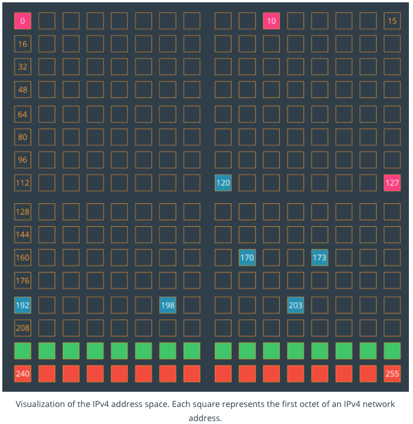

#Addressing Space
Here's a visualization of the entire IPv4 address space. Each square represents one possible value of the first octet of an address. For instance, the square on the top right, labeled 15, represents all the IPv4 addresses that start with 15 as their first octet (e.g. 15.72.9.277).



* The pink squares (```0```, ```10```, and ```127```) are blocks that are entirely reserved.
* The blue squares are blocks that are partially reserved. For instance, not all of the ```192``` block is reserved, but some of it is.
* The entire green row (starting at ```224```) is set aside for [IP multicast](https://en.wikipedia.org/wiki/IP_multicast).
* And the entire orange bottom row (starting at ```240```) was [originally set aside for "future use" but was effectively lost due to being blocked as invalid](http://packetlife.net/blog/2010/oct/14/ipv4-exhaustion-what-about-class-e-addresses/).

As you can see, there aren't enough IP addresses to go around - but we'll get into how we manage that a little bit later!


##Additional Resources
* [RFC 6890 - Special-Purpose IP Address Registries, April 2013](https://tools.ietf.org/html/rfc6890)
* [RFC 1918 - Address Allocation for Private Internets, February 1996](https://tools.ietf.org/html/rfc1918)
* Learn more about [Wikipedia - IPv4 Address Exhaustion](https://en.wikipedia.org/wiki/IPv4_address_exhaustion)