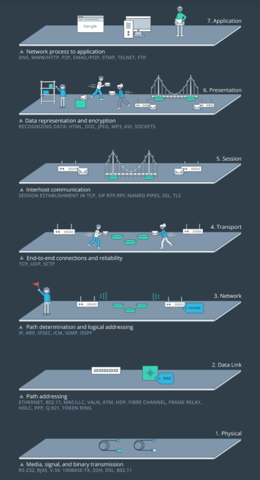

# OSI Model

Layers in the OSI Model
We're going to look at all of the layers in the OSI model. But before we do that, I just want to point out again that this is a conceptual model for a network system to handle communication; it's not a concrete example of how network communication happens. The OSI layers will be listed here for you to look them over, and then there will be a video to walk through them in more detail. You don't need to memorize this information. Instead, you should focus on absorbing how the layers are arranged. Later, you'll study these layers in more detail.

There are 7 layers in the OSI model. We'll start at the top-most layer, layer 7, and work our way down to layer 1.

Layer 7 - Application

Layer 6 - Presentation

Layer 5 - Session

Layer 4 - Transport

Layer 3 - Network

Layer 2 - Data Link

Layer 1 - Physical

Remember that the OSI model is a conceptual model of how network communication occurs. For network communication to happen, the layers must work together to transmit a message from one device to another.

#Standards and Protocols



As we've been talking about, the OSI model is a conceptual model and helps describe data in many ways. It provides a standard for how network communication occurs, how data is transferred, and provides a way to group similar protocols together.

For example, network devices can be grouped at several different layers in the OSI model. Layer 1 of the OSI model deals with the physical and electrical specification for devices. Items such as physical cables, wireless signless, the network identification card (NIC) inside a computer are all grouped at the Layer 1 level. But even though Layer 1 is called the physical layer, that doesn't mean that every physical device shows up there. For example, a switch is a Layer 2 device and a router is a Layer 3 device.

The OSI Model also helps group network protocols together. Here are some of the most common protocols at each layer:

* Layer 7 = HTTP
* Layer 6 = SSL and TLS
* Layer 5 = socket
* Layer 4 = TCP and UDP
* Layer 3 = IP and ICMP
* Layer 2 = ARP
* Layer 1 = 1000BASE-T, DSL, DOCSIS, 802.11a/b/g/n

The information that goes along with the OSI Model is vast and deep, and we're not going to go into more detail on the standards and protocols than we have right here. I just want you to be aware of another aspect of the OSI model and to see from another perspective how it is a conceptual model to help group information.

#Sibling Dependence
In the OSI model, a layer is only concerned with the layers above and below it. For example, layer 3 (the Network layer) is only concerned with the two layers that are on either side of it:

* Layer 4 - the Transport layer
* Layer 2 - the Data Link layer
Layer 3 will receive data from Layer 4 and send it to Layer 2 or it will receive data from Layer 2 and send it to Layer 4.

Layer 7 (the Application layer) is at the very top of the OSI model. Since it is at the top, it is only concerned with sending data to Layer 6 (the Presentation layer) or receiving data from Layer 6.

A single layer does not need to know the whole path that data takes through the OSI model. It just need to know about the layers above and below it that it needs to interact with. Now, why is this important? Each layer in the OSI model is an abstraction layer. An [abstraction layer](https://en.wikipedia.org/wiki/Abstraction_layer) is:
```
a way of hiding the working details of a subsystem

```
For example, the way that the data is formatted, processed, and changed in Layer 2 does not matter to Layer 4, because Layer 3 abstracts those implementation details away. All Layer 4 has to worry about is how it needs to receive data from Layer 3 - it doesn't have to worry about the specifics of Layer 2 (since that's Layer 3's job).

Earlier, I said:

````
Layer 3 will receive data from Layer 4 and send it to Layer 2 or it will receive data from Layer 2 and send it to Layer 4.
````
When does data move down the layers from Layer 4 to Layer 3 to Layer 2 and when does the data move up the layers from Layer 2 to Layer 3 to Layer 4? These two processes are called **encapsulation** and **decapsulation**. Let's take a look at them in more detail.

#Encapsulation and Decapsulation
Remember that the OSI model is a conceptual model of how data is packaged and sent across a network to another device. In this scenario, let's assume that there are only two devices that are trying to communicate with each other. The OSI model is used on both devices.

As the data is being packaged up on a sending device, the data moves down the OSI model; this process of the data moving down the OSI model is called **encapsulation**.

When the data is being unpacked on a receiving device, the data moves _up_ OSI model; this process of the data moving up the OSI model is called **decapsulation**.

Let's see each of these in more detail. First, we'll start with encapsulation.

To recap, when data travels down the OSI model, the data from a higher layer becomes the "payload" for a lower layer. When the data moves from a higher layer to a lower layer, the data is wrapped in new information called a "header" and a "footer". This is where it gets the name "encapsulation"; because the data is wrapped (or encapsulated) with new header/footer layers.

Conversely, the opposite happens when traveling up the OSI model. As the data moves up the OSI model, these header/footer layers are removed. This is where it gets the name "decapsulation".

#Network Transmission
Hopefully you're seeing how the OSI model can helps us to understand how network communication happens across a network. You saw how encapsulation works on the sending device. Then you saw how decapsulation works on the destination device. We looked at both of these in isolation so that we could zoom in on exactly what's going on with encapsulation and decapsulation. But now, let's zoom back out a bit and see how data moves from one device to another in a network.

We're going to look at one device sending data from one network to another device in a different network. We'll be using all of the information that we've covered up to this point, so this video might be a bit complicated. You might need to rewatch the video once or twice to let these concepts sink in.

To recap, as data moves across a network, each devices looks at specific header information to determine if the data belongs to itself or if it should forward the data on to another device. One thing to note here is that this process of moving up and down the OSI model (the process of encapsulation and decapsulation) happens over and over as the data moves from one device to another. To clarify, though, the information doesn't move all the way up through all of the OSI layers at each device, it only does that at the final (target) device.

#Summary
In this section we looked at the layers of the OSI model, how data moves down the OSI model on a device, how it moves across a network, and how data moves _up_ the OSI model on the target device.

The OSI Model layers are:

* Layer 7 - Application
* Layer 6 - Presentation
* Layer 5 - Session
* Layer 4 - Transport
* Layer 3 - Network
* Layer 2 - Data Link
* Layer 1 - Physical

The process of data moving down the layers is called encapsulation. The process of data moving up the layers is called decapsulation.