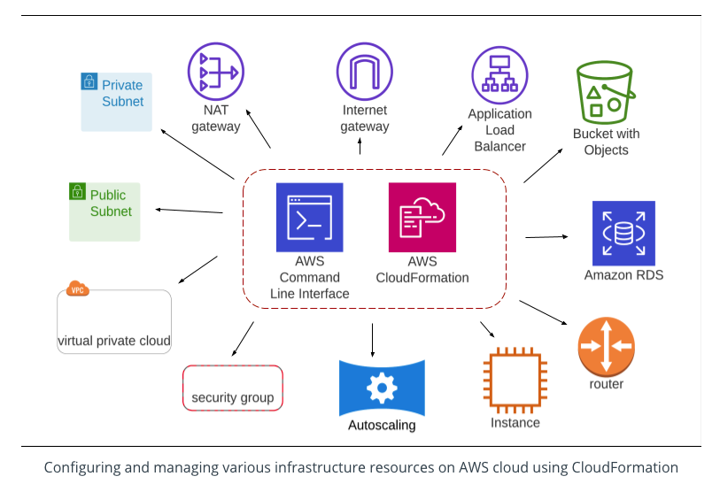

##What is (Cloud) Infrastructure?
Cloud services are broadly categorized as Software as a Service (SaaS), Platform as a Service (PaaS), or Infrastructure as a Service (IaaS). Cloud is a collection of geographically distributed data centers that are logically grouped into regions and availability-zones.

The IaaS allows a user to provision Virtual Machines (VMs), set up networks (VPC), create subnets, and associate necessary security features. Further, VMs can be attached to storage volumes, different networks, or servers. All the resources mentioned above are referred to as **Infrastructure**.

The diagram below shows various cloud infrastructure resources that we will learn to provision on the AWS cloud using the AWS command line and CloudFormation tools. These are the primary resources that are required to build a web app architecture.

