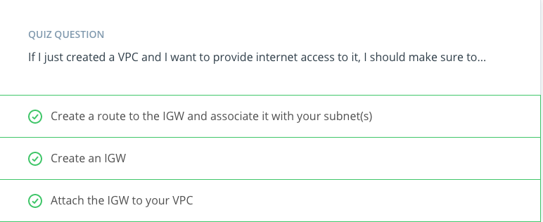

##Software Defined Networking
What we have created here it's called Software Defined Networking. That is, using APIs and already-existing physical infrastructure to create our own networking layer on top, with our own privacy rules, our own routing and our own Private IP Space.

##VPN or Virtual Private Network
It is a type of encrypted connectivity that You can setup between your on-premise data center and your Virtual Private Cloud. This allows access in and out of your AWS VPC in a secure manner, across the internet and using internal, Private IP addresses.

##DirectConnect
It is a DirectConnect is a physical data line that you can purchase directly from AWS or through a telecommunication service provider to access your AWS Cloud without moving your data traffic across the public internet.

##Internet Gateway
* An internet gateway is a resource that enables inbound and outbound traffic from the internet to your VPC.
* An internet gateway allows external users access to communicate with parts of your VPC.
* If you create a private VPC for an application that is internal to your company, you will not need an internet gateway.

##Recommended Read
* [Read more about Internet Gateways](https://docs.aws.amazon.com/vpc/latest/userguide/VPC_Internet_Gateway.html)

