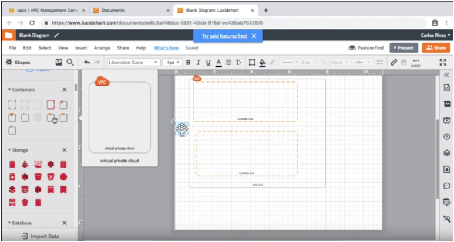
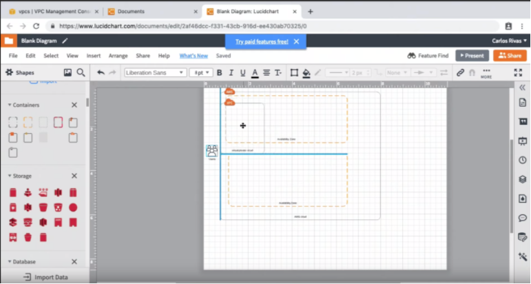
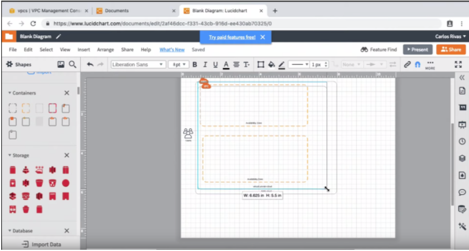
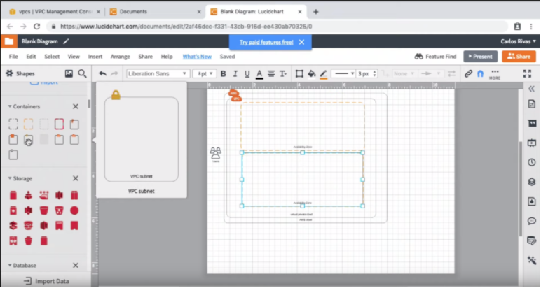
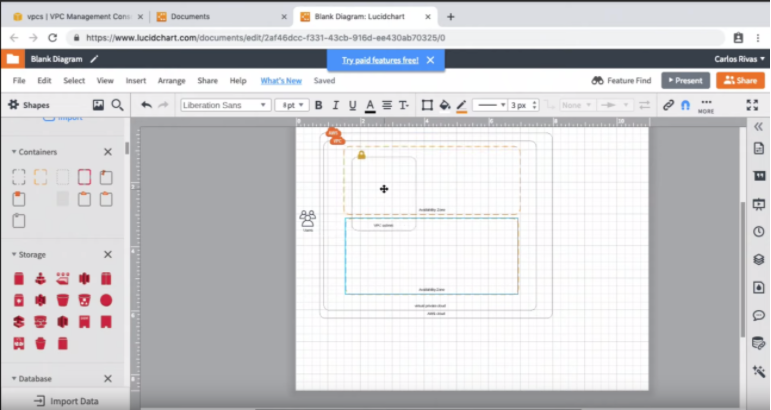
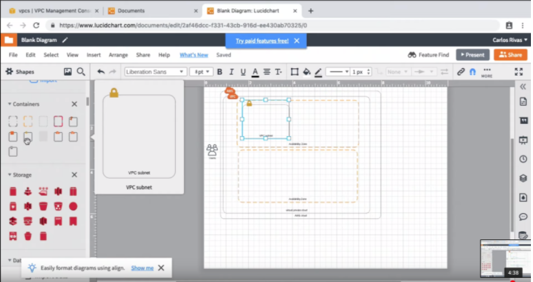
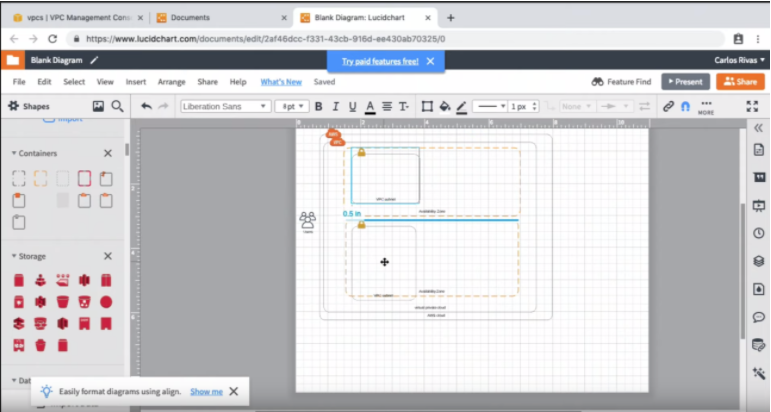
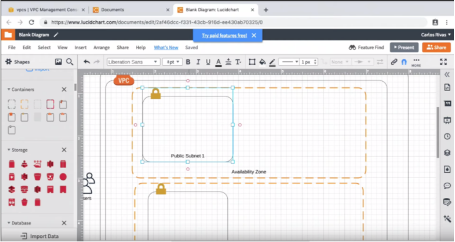
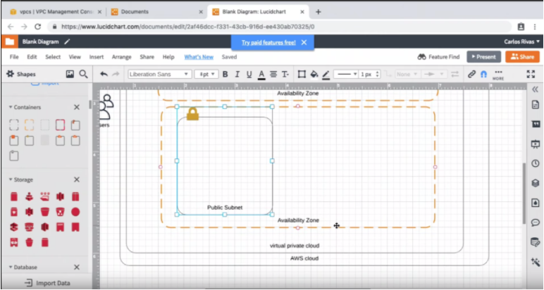

#VPC
1. **Locate** the ```Virtual Private Cloud``` container from the ```Shapes``` panel.
    

2. **Drag** the ```Virtual Private Cloud``` container onto your canvas.
    
3. Arrange your ```Virtual Private Cloud``` container so that it encloses both of your ```Availability Zones```.
    
4. **Locate** the ```VPC_subnet``` container from the ```Shapes``` panel.
    
5. **Drag** the ```VPC_subnet``` container onto your canvas and place it inside of your first ```Availability Zone```.
    
    
6. **Drag** another ```VPC_subnet``` container onto your canvas, but this time place it in your second ```Availability Zone```.
    
7. **Rename** the top ```VPC_subnet``` container to ```Public Subnet 1``` and the bottom ```VPC_subnet``` container to ```Public Subnet```.
    
   
    
