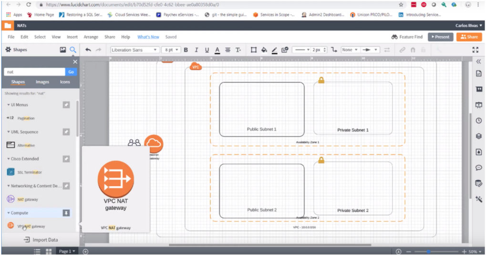
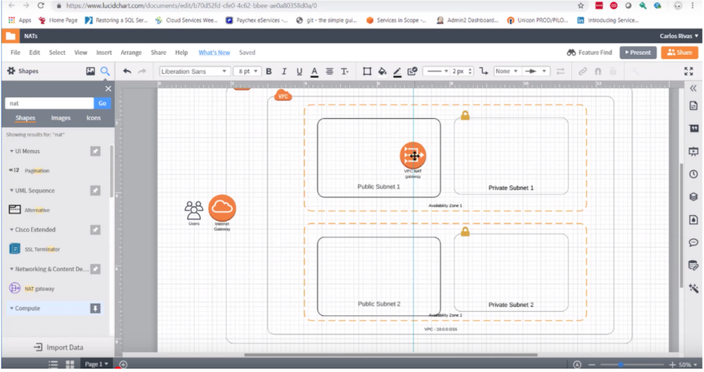
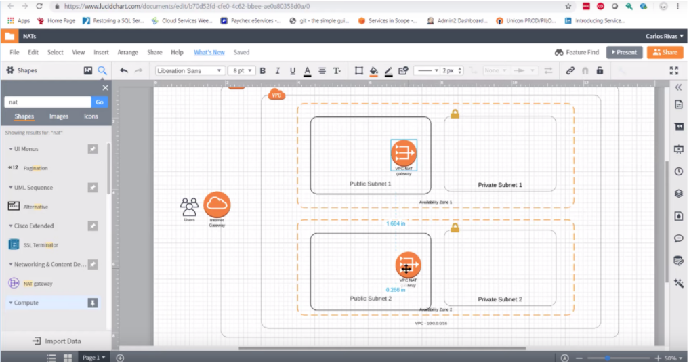

#NAT's
1. **Search** the shapes panel for ```VPC_NAT``` gateway.
    
2. **Drag** the ```VPC_NAT``` gateway shape onto your canvas and place it directly inside ```Public Subnet 1```.
    
3. **Repeat** step 3, but instead place your new ```VPC_NAT gateway``` inside of ```Public Subnet 2```.
    

