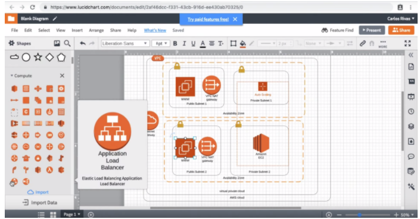
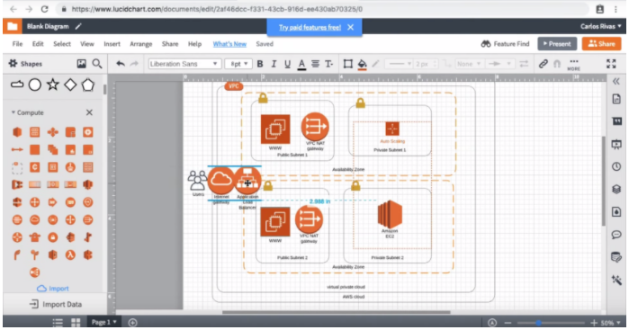

**Important**: Before this section we have taken the liberty of adding an Amazon EC2 Instance directly inside of Public Subnet 1 & our AutoScaling. Please take the time to add this to your diagram before continuing with this exercise.

#Load Balancer

1. **Search** shapes panel for ```Compute``` section and find the ```Application Load Balancer``` .
    
2. **Drag** the ```Application Load Balancer``` onto your canvas and place it on the right side of your ```Internet Gateway```.
    
