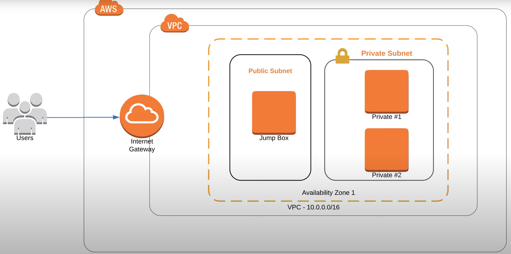

##Security Groups
* Security groups are specific to individual resources (EC2 servers, databases) and not to subnets.
* [Documentation for security groups in CloudFormation](https://docs.aws.amazon.com/AWSCloudFormation/latest/UserGuide/aws-properties-ec2-security-group.html)
##Traffic is blocked by default
* In cloud, traffic is completely blocked, so you have to explicitly open ports to allow traffic in and out. This is a general networking concept.
##Limit inbound traffic for security
* For ingress rules, we want to limit inbound traffic, for security, to a single port or just a handful of ports required by the application we are running.
* If it’s a public web server, for example, it will require ```port 80``` open to the world ( World = ```0.0.0.0/0``` )
* Should you need the SSH port open, restrict this port only to your specific IP address.
##For outbound traffic, give full access
For egress rules, we want to give the resource full access to the internet, so we give egress access to all ports, from ```0``` all the way to ```65535```.


##Accessing Servers in a Private Subnet via Jump Box



####Resources
* [Security Group Rules Reference](https://docs.aws.amazon.com/AWSEC2/latest/UserGuide/security-group-rules-reference.html)